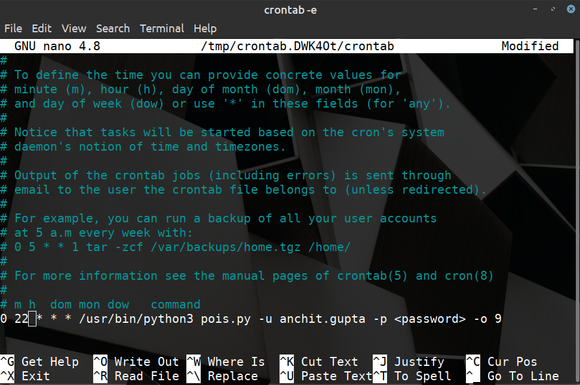

# POIS-Questionnaire-Filler

A code to fill daily questionnaire for POIS course.

## Requirements

- Selenium
- Argparse
```
$ pip install selenium argparse
```
- [Chromedriver](https://chromedriver.chromium.org/downloads) for Chrome/ [Geckodriver](https://github.com/mozilla/geckodriver/releases) for firefox

After downloading chromedriver/geckodriver, follow these steps:
```
$ chmod +x chromedriver
$ sudo mv chromedriver /usr/local/bin
$ export PATH=$PATH:/usr/local/bin/chromedriver
```

The above steps are for Google Chrome, replace chromedriver with geckodriver for Firefox browser

## Running the code

```
$ python pois.py -h

usage: login.py [-h] [-b {c,f}] -u USERNAME -p PASSWORD [-t TYPE] [-o {1,2,3,4,5,6,7,8,9,10}]

POIS Questionnaire Filler

optional arguments:
  -h, --help            show this help message and exit
  -b {c,f}, --browser {c,f}
                        select browser Google Chrome(c)/Firefox(f), by default Chrome
  -u USERNAME, --username USERNAME
                        <name.surname>
  -p PASSWORD, --password PASSWORD
                        <password>
  -t TYPE, --type TYPE  research(r)/students(s) account, by default research(r)
  -o {1,2,3,4,5,6,7,8,9,10}, --option {1,2,3,4,5,6,7,8,9,10}
                        (1) Did Nothing
                        (2) Self discovery 
                        (3) Reading/Learning from some outside source (books, wiki, YouTube etc) 
                        (4) Brainstorming with friends 
                        (5) Intersection of (2) & (3) 
                        (6) Intersection of (2) & (4) 
                        (7) Intersection of (3) & (4) 
                        (8) All of (2), (3) and (4) 
                        (9) Couldn't find time 
                        (10) Not interested in the course
                        
                        By default (1) Did Nothing
```

For example, to submit **(9) Couldn't find time** in the form, run the following command:
```
$ python pois.py -u anchit.gupta -p <password> -o 9
```

For students account, run the following command:
```
$ python pois.py -u name.surname -p <password> -t s -o 9
```

## Finally adding this to cron job

Open crontab file:
```
$ crontab -e
```

Add the following line in editor to fill the form everyday at 10pm
```
* 22 * * * /usr/bin/python3 pois.py -u anchit.gupta -p <password> -o 9
```

Other example:

Everyday at 10:45 pm
```
45 22 * * * <command> 
```
To check meaning of custom crontab expression checkout https://crontab.guru/


